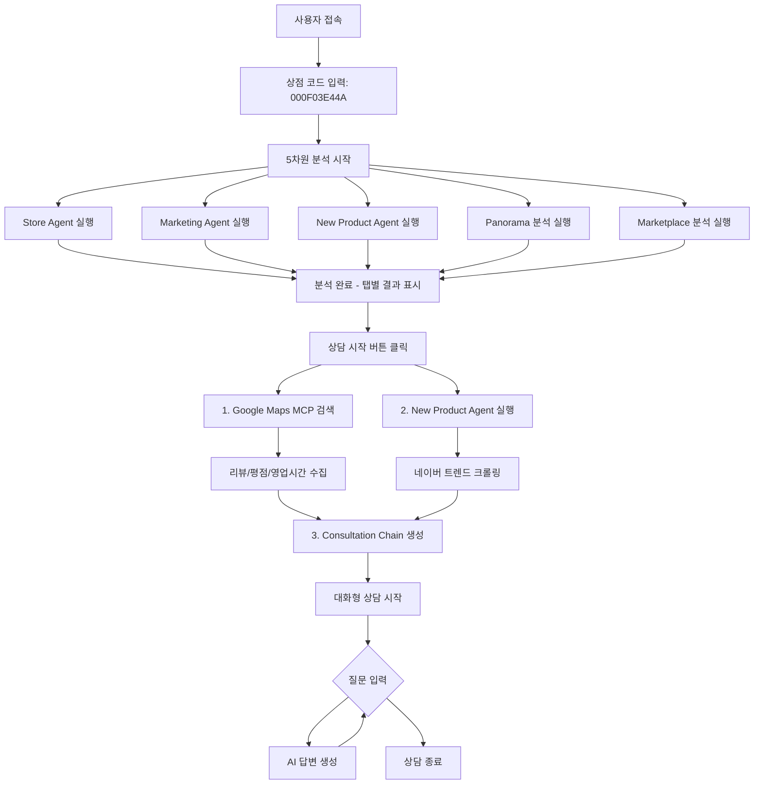

# 비밀 상담사 AI 시스템

**BigContest AI Agent** - Gemini 2.5 Flash + Google Maps MCP 기반 1:1 비밀 상담 서비스

## 📋 프로젝트 개요

**비밀 상담사 AI 시스템**은 Gemini 2.5 Flash와 Google Maps MCP를 활용한 멀티에이전트 시스템으로, 상점 코드만으로 가게의 상권, 업종, 접근성, 리뷰 등을 종합적으로 분석하고 맞춤형 마케팅 전략을 제안하는 프리미엄 상담 서비스입니다.

### 🎯 핵심 특징

- **1:1 비밀 상담**: 상점 코드 기반 개인화된 상담 서비스
- **5차원 종합 분석**: 매장, 고객, 이동패턴, 파노라마, 상권 분석
- **Google Maps MCP 통합**: 리뷰, 평점, 영업시간 자동 검색
- **실시간 AI 분석**: Gemini 2.5 Flash 기반 즉시 분석 및 인사이트 제공
- **신메뉴 추천**: 네이버 크롤링 기반 트렌드 분석 및 신메뉴 제안
- **대화형 상담**: LangChain 기반 자연스러운 질의응답

# 🏗️ 아키텍처

```
bigcontest_ai_agent/
│
├── .env                        # 🔐 환경변수 (상대경로 사용)
├── requirements.txt            # 📦 전체 의존성
├── SETUP.md                    # 📘 설치 및 실행 가이드
│
├── data/                       # 📊 데이터 파일
│   └── matched_store_results.csv  # 매장 정보 (4,187개)
│
├── agents_new/                 # 🧠 AI 에이전트
│   ├── google_map_mcp/         # 🗺️ Google Maps MCP 검색
│   ├── store_agent/            # 🏪 매장 분석 에이전트
│   ├── marketing_agent/        # 📈 마케팅 전략 에이전트
│   ├── new_product_agent/      # 🍜 신메뉴 추천 에이전트
│   ├── panorama_img_anal/      # 🌆 파노라마 이미지 분석
│   └── marketplcae_anal/       # 🏬 상권 분석
│
├── open_sdk/                   # 🎨 Streamlit 프론트엔드
│   └── streamlit_app/
│       ├── app.py              # 메인 Streamlit 앱
│       ├── ai_agents/          # AI 상담 에이전트
│       │   ├── consultation_agent.py  # 대화형 상담
│       │   └── query_classifier.py    # 질문 분류
│       ├── utils/              # 유틸리티
│       │   └── store_search_processor.py  # MCP 검색 처리
│       └── requirements.txt    # Streamlit 의존성
│
├── output/                     # 📦 분석 결과 출력
│   └── store_mcp_searches/     # Google Maps MCP 검색 결과
│
└── configs/                    # ⚙️ 설정 파일
    ├── weights.yml             # 지표 가중치
    ├── thresholds.yml          # 경고 임계값
    ├── prescriptions.yml       # 개선 액션
    └── paths.yml               # 파일 경로
```

## 🚀 비밀 상담사 시스템 주요 기능

### 🔐 1단계: 상점 코드 입력 및 분석 요청

사용자는 10자리 상점 코드 (예: `000F03E44A`, `002816BA73`)를 입력하여 비밀 상담을 시작합니다.

### 📊 2단계: 5차원 종합 분석 실행 (약 3-5분)

#### 🏪 **Store Agent 분석** (매장 성과 분석)

- **매장 개요**: 매장명, 주소, 업종, 상권 정보 자동 추출
- **매출 분석**: 매출 트렌드, 순위분석, 취소율 분석을 통한 매출 성과 파악
- **고객 분석**: 성별, 연령별, 재방문율 등 고객 특성 분석
- **JSON/MD 리포트**: 구조화된 분석 데이터 생성

#### � **Marketing Agent 분석** (마케팅 전략)

- **페르소나 생성**: 동적 고객 페르소나 5개 자동 생성
- **리스크 분석**: 매장의 위험 요소 파악
- **마케팅 전략**: 타겟별 맞춤형 마케팅 전략 제안
- **실행 계획**: 구체적인 실행 방안 제시

#### 🍜 **New Product Agent** (신메뉴 추천)

- **네이버 크롤링**: 트렌드 키워드 자동 수집
- **트렌드 분석**: 현재 유행하는 메뉴/재료 파악
- **신메뉴 제안**: 매장 특성에 맞는 신메뉴 추천
- **차별화 전략**: 경쟁 매장과의 차별화 포인트

#### 🌆 **Panorama 지역 분석**

- **실시간 이미지 분석**: 300m 반경 내 5개 파노라마 이미지를 Gemini로 분석
- **종합 점수**: 상권 분위기, 도로 분위기, 청결도, 보행환경, 업종다양성 점수
- **강점/약점 분석**: 지역 특성 기반 강점과 약점 도출
- **추천 업종**: 해당 지역에 적합한 업종 제안

#### 🏬 **Marketplace 상권분석**

- **상권 현황**: 규모, 특성, 경쟁환경 분석
- **유동인구 패턴**: 시간대별 유동인구 특성
- **입지 적합성**: 매장 입지의 적합성 평가
- **PDF 리포트**: 상권분석 서비스 결과 자동 생성

### 💬 3단계: 상담 시작 (Google Maps MCP 통합)

#### 🗺️ **Google Maps MCP 검색** (자동 실행)

분석 완료 후 "💬 상담 시작" 버튼 클릭 시:

1. **자동 MCP 검색**: 매장 이름 + 주소로 Google Maps 검색
2. **정보 수집**:
   - 평점 (예: 4.3/5.0)
   - 리뷰 개수 및 내용
   - 영업시간 (월~일)
   - 전화번호
   - 가격대 (메뉴별)
   - 장단점 분석
3. **TXT 파일 저장**: `output/store_mcp_searches/{store_code}.txt`

#### 🤖 **New Product Agent 실행** (네이버 크롤링)

- 30초 타임아웃으로 백그라운드 실행
- 트렌드 키워드 수집 및 신메뉴 제안

#### 💡 **LangChain Consultation Chain 생성**

- 모든 분석 결과 통합 (JSON + MD + MCP txt)
- 대화형 상담 준비 완료

### 🗨️ 4단계: 대화형 AI 상담

사용자는 자연스러운 질문으로 상담 가능:

```
"매장 리뷰 분석해줘"
→ Google Maps 리뷰 5개 + 장단점 분석 제공

"영업시간은?"
→ 월~토: 11:30-15:00, 17:00-21:30 / 일: 휴무

"마케팅 전략은?"
→ 5개 페르소나별 맞춤 전략 제공

"신메뉴 추천해줘"
→ 트렌드 기반 신메뉴 3개 제안
```

#### 📋 **데이터 기반 답변**

AI는 다음 데이터를 모두 활용:
- ✅ Google Maps MCP (리뷰, 평점, 영업시간)
- ✅ Store Analysis JSON
- ✅ Marketing Analysis JSON
- ✅ New Product Recommendations
- ✅ Panorama Analysis
- ✅ Marketplace Analysis
- ✅ Merged Analysis MD (통합 리포트)

## 👤 사용자 플로우 (User Flow)



### 🔄 상세 사용 플로우

#### 1️⃣ **시작**

- 브라우저에서 `http://localhost:8501` 접속
- 10자리 상점 코드 입력 (예: `000F03E44A`)

#### 2️⃣ **분석 진행** (약 3-5분)

```
🔄 5차원 종합 분석 시작...
✅ Store Agent 완료 (매장 성과 분석)
✅ Marketing Agent 완료 (마케팅 전략)
✅ New Product Agent 완료 (신메뉴 추천)
✅ Panorama 완료 (지역 특성 분석)
✅ Marketplace 완료 (상권 분석)

📊 분석 완료! 탭에서 결과를 확인하세요.
```

#### 3️⃣ **결과 확인 (탭별 표시)**

오른쪽 패널에서 각 탭을 클릭하여 확인:

- **🏪 개요**: 매장 기본 정보 + Google Maps 정보 (Expander)
- **� 고객 분석**: 성별/연령/재방문율 차트
- **� 이동 패턴**: 시간대별/요일별 이동 특성
- **🌆 지역 분석**: 파노라마 이미지 분석 결과
- **🏬 상권 분석**: 상권 현황 및 경쟁 환경
- **� 마케팅**: 5개 페르소나 + 마케팅 전략
- **🍜 신메뉴 추천**: 트렌드 기반 신메뉴 제안

#### 4️⃣ **상담 시작**

"💬 상담 시작" 버튼 클릭 시:

```
[1/2] MCP 매장 검색 먼저 실행!
✅ MCP 검색 성공! 저장: output/store_mcp_searches/000F03E44A.txt

[2/2] New Product Agent 실행 (네이버 크롤링)
✅ 신메뉴 추천 완료

[3/3] Langchain Consultation Chain 생성 중...
✅ 상담 모드가 활성화되었습니다!
```

#### 5️⃣ **대화형 상담**

자연스러운 질문으로 상담:

```
👤 "매장 리뷰 분석해줘"
🤖 [Google Maps 리뷰 5개 요약 + 장단점 분석]
   📋 참고 자료: Google Maps API

👤 "영업시간은?"
🤖 월~토: 11:30 AM – 3:00 PM, 5:00 – 9:30 PM
   일요일: 휴무
   📋 참고 자료: Google Maps API

👤 "신메뉴 추천해줘"
🤖 [트렌드 기반 신메뉴 3개 제안 + 차별화 전략]
   📋 참고 자료: new_product_recommendations.json
```

### 🎯 상점 코드 정보

- **형식**: 10자리 영숫자 (예: `000F03E44A`, `002816BA73`)
- **데이터**: `final_merged_data.csv`에서 86,592개 상점 정보 관리
- **자동 매칭**: CSV에서 상점 코드 확인 후 주소 자동 추출

### ⚡ 실시간 분석 과정

1. **Store Code 검증** → CSV에서 매장 정보 확인
2. **주소 추출** → 상권 분석용 주소 정보 획득
3. **5개 Agent 병렬 실행**:
   - Store Agent: PNG 차트 분석 (Gemini AI)
   - Mobility: 이동 패턴 차트 분석
   - Panorama: 실시간 이미지 5개 분석
   - Marketplace: 상권 데이터 분석
   - Marketing: 종합 전략 생성

### 📊 결과물

- **즉시 표시**: Streamlit 웹 인터페이스
- **PNG 차트**: 각 분석별 시각화 차트
- **JSON 리포트**: 구조화된 분석 데이터
- **PDF 리포트**: 상권분석 서비스 결과

## 🛠️ 설치 및 실행

> 📘 자세한 내용은 [SETUP.md](./SETUP.md)를 참고하세요.

### 빠른 시작 (Quick Start)

```bash
# 1. 저장소 클론
git clone https://github.com/urbanking/DA4U_bigcontest.git
cd bigcontest_ai_agent

# 2. 의존성 설치
pip install -r requirements.txt

# 3. 환경변수 설정
# .env 파일에 API 키 설정 필요:
# - GEMINI_API_KEY (필수)
# - Google_Map_API_KEY (필수)
# - LANGFUSE_PUBLIC_KEY, LANGFUSE_SECRET_KEY (선택)

# 4. Streamlit 앱 실행
cd open_sdk/streamlit_app
streamlit run app.py
```

### 브라우저 접속

- 자동으로 열리지 않으면: http://localhost:8501
- 10자리 상점 코드 입력 (예: `000F03E44A`)

### 필수 환경변수

```bash
# .env 파일
GEMINI_API_KEY=your_gemini_api_key_here
Google_Map_API_KEY=your_google_maps_api_key_here

# 선택 (모니터링)
LANGFUSE_PUBLIC_KEY=your_langfuse_public_key
LANGFUSE_SECRET_KEY=your_langfuse_secret_key
LANGFUSE_HOST=https://cloud.langfuse.com
```

### 주요 디렉토리 구조

```bash
bigcontest_ai_agent/
├── data/matched_store_results.csv  # 4,187개 매장 데이터
├── open_sdk/streamlit_app/app.py   # Streamlit 앱
├── agents_new/                     # AI 에이전트 모듈
└── output/                         # 분석 결과 저장
```

## � 기술 스택

### AI/LLM
- **Gemini 2.5 Flash**: 메인 LLM (via OpenAI SDK)
- **LangChain**: 대화형 상담 체인
- **Langfuse**: AI 모니터링 및 트레이싱

### MCP (Model Context Protocol)
- **Google Maps MCP**: 매장 리뷰, 평점, 영업시간 자동 검색
- **@modelcontextprotocol/server-google-maps**: MCP 서버

### 웹 크롤링
- **Selenium**: 네이버 트렌드 크롤링
- **BeautifulSoup**: HTML 파싱

### 데이터 분석
- **Pandas**: 데이터 처리
- **GeoPandas**: 지리 데이터 분석
- **Shapely**: 공간 데이터 처리

### 시각화
- **Plotly**: 인터랙티브 차트
- **Matplotlib**: 정적 차트
- **Seaborn**: 통계 시각화
- **Folium**: 지도 시각화

### 프론트엔드
- **Streamlit**: 웹 UI 프레임워크

### 기타
- **Python-dotenv**: 환경변수 관리
- **Requests/HTTPX**: HTTP 클라이언트
- **Geopy**: 지오코딩

## 📂 출력 파일

### output/store_mcp_searches/
- `{store_code}_{timestamp}.txt`: Google Maps MCP 검색 결과

### open_sdk/output/
- `analysis_{store_code}_{timestamp}/`: 5차원 분석 결과
  - `store_analysis.json`: Store Agent 결과
  - `marketing_analysis.json`: Marketing Agent 결과
  - `new_product_recommendations.json`: 신메뉴 추천
  - `panorama_analysis.json`: 파노라마 분석
  - `marketplace_analysis.json`: 상권 분석
  - `merged_analysis_full.json`: 통합 JSON
  - `merged_analysis_full.md`: 통합 마크다운 리포트

## ⚠️ 주의사항

### 필수 요구사항
- Python 3.10 이상
- Gemini API 키 (필수)
- Google Maps API 키 (필수)
- 안정적인 인터넷 연결

### 경로 설정
- 모든 경로는 **상대경로** 사용
- `.env` 파일에서 환경변수로 관리
- 절대경로 사용 시 다른 환경에서 오류 발생 가능

### API 사용량
- Gemini API: 무료 티어 제한 확인
- Google Maps API: 크레딧 소진 주의
- Langfuse: 무료 티어 제한 확인

### 데이터 파일
- `data/matched_store_results.csv`: 4,187개 매장 정보 필수
- 매장 코드는 정확히 10자리 (예: `000F03E44A`)

## 🐛 문제 해결 (Troubleshooting)

### Import Error
```bash
# Python path 확인
python -c "import sys; print(sys.path)"

# 모듈 재설치
pip install -r requirements.txt --upgrade
```

### API Key Error
```bash
# .env 파일 확인
cat .env | grep API_KEY

# 환경변수 로드 확인
python -c "from dotenv import load_dotenv; load_dotenv(); import os; print(os.getenv('GEMINI_API_KEY'))"
```

### Streamlit Error
```bash
# 캐시 삭제
streamlit cache clear

# 포트 변경
streamlit run app.py --server.port 8502
```

### MCP 검색 실패
- Google Maps API 키 확인
- `matched_store_results.csv`에 매장 정보 존재 여부 확인
- 매칭_상호명 컬럼에 실제 매장 이름 있는지 확인

### New Product Agent 타임아웃
- 네이버 크롤링은 30초 타임아웃 설정
- 타임아웃 시에도 다른 기능은 정상 작동
- 필요시 `app.py`에서 타임아웃 조정 가능

## 📊 데이터 정보

### matched_store_results.csv
- **전체 매장 수**: 4,187개
- **주요 컬럼**:
  - `코드`: 10자리 상점 코드
  - `입력_주소`: 매장 주소
  - `입력_가맹점명`: 마스킹된 매장명 (예: "육육**")
  - `매칭_상호명`: 실제 매장명 (예: "육육면관")
  - `매칭_주소`: Google Maps 매칭 주소
  - `lat`, `lng`: 위도, 경도
  - `place_id`: Google Place ID

## 🎯 주요 기능별 데이터 흐름

### Store Agent
```
CSV 매장 정보 → Store Agent 분석 → JSON/MD 리포트
```

### Marketing Agent
```
Store 분석 결과 → 페르소나 생성 → 마케팅 전략 → JSON 저장
```

### New Product Agent
```
네이버 크롤링 → 트렌드 분석 → 신메뉴 제안 → JSON 저장
```

### Google Maps MCP
```
매장명 + 주소 → MCP 검색 → 리뷰/평점/영업시간 → TXT 저장
```

### Consultation Agent
```
모든 분석 결과 통합 → LangChain Chain → 대화형 답변
```

## 📚 추가 문서

- **[SETUP.md](./SETUP.md)**: 설치 및 실행 상세 가이드
- **[agents_new/new_product_agent/README.md](./agents_new/new_product_agent/README.md)**: 신메뉴 추천 에이전트 가이드
- **[agents_new/new_product_agent/CRAWLING_INPUT_GUIDE.md](./agents_new/new_product_agent/CRAWLING_INPUT_GUIDE.md)**: 크롤링 입력 가이드

## 🤝 기여

이 프로젝트는 BigContest AI Agent 프로젝트의 일환으로 개발되었습니다.

### 개발 브랜치
- **Repository**: urbanking/DA4U_bigcontest
- **Branch**: chanwoo

## 📄 라이선스

MIT License

## 📧 문의

프로젝트 관련 문의사항이 있으시면 GitHub Issues를 등록해주세요.

---

Made with ❤️ by BigContest Team | Powered by Gemini 2.5 Flash & Google Maps MCP
