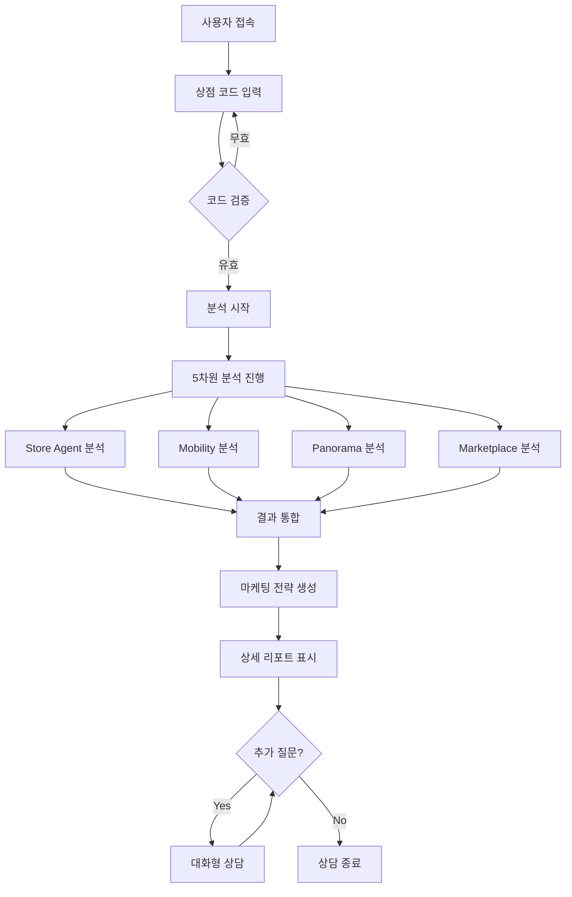

# 비밀 상담사 AI 시스템

**BigContest AI Agent** - OpenAI Agents SDK 기반 1:1 비밀 상담 서비스

## 📋 프로젝트 개요

**비밀 상담사 AI 시스템**은 OpenAI Agents SDK를 활용한 멀티에이전트 시스템으로, 상점 코드만으로 가게의 상권, 업종, 접근성 등을 종합적으로 분석하고 맞춤형 마케팅 전략을 제안하는 프리미엄 상담 서비스입니다.

### 🎯 핵심 특징

- **1:1 비밀 상담**: 상점 코드 기반 개인화된 상담 서비스
- **5차원 종합 분석**: 상권, 고객, 이동패턴, 파노라마, 마케팅 전략
- **실시간 AI 분석**: Gemini 2.5 Flash 기반 즉시 분석 및 인사이트 제공
- **시각화 리포트**: PNG 차트와 PDF 리포트로 직관적 결과 제공

# 🏗️ 아키텍처

```
bigcontest_ai_agent/
│
├── backend/                    # ⚙️ FastAPI 서버
│   ├── core/                   # 핵심 설정 및 유틸리티
│   ├── routers/                # API 라우터
│   ├── services/               # 비즈니스 로직
│   ├── models/                 # ORM 모델
│   └── schemas/                # Pydantic 스키마
│
├── agents_new/                 # 🧠 AI 에이전트
│   ├── store_agent/            # 가게 분석 에이전트
│   ├── panorama_img_anal/      # 파노라마 이미지 분석
│   ├── marketplcae_anal/       # 상권 분석
│   └── ultra_simple_agent.py   # 통합 에이전트
│
├── frontend/                   # 🌐 Streamlit 프론트엔드
│   ├── pages/                  # 페이지 컴포넌트
│   ├── components/             # UI 컴포넌트
│   └── utils/                  # 유틸리티
│
├── configs/                    # ⚙️ 설정 파일
├── outputs/                    # 📦 결과 저장
└── tests/                      # ✅ 테스트 스위트
```

## 🚀 비밀 상담사 시스템 주요 기능

### 🔐 1단계: 상점 코드 입력 및 분석 요청

사용자는 10자리 상점 코드 (예: `000F03E44A`, `002816BA73`)를 입력하여 비밀 상담을 시작합니다.

### 📊 2단계: 5차원 종합 분석 실행

#### 🏪 **Store Agent 분석** (매장 고객 분석)

- **PNG 차트 분석**: 매장개요, 성별분포, 연령대별분포, 상세고객비율 등 차트를 Gemini AI로 분석
- **매장 개요**: 매장명, 주소, 업종, 상권 정보 자동 추출
- **매출 분석**: 매출 트렌드, 순위분석, 취소율 분석을 통한 매출 성과 파악
- **고객 분석**: 성별, 연령별, 재방문율 등 고객 특성 분석

#### 🚶 **Mobility 패턴 분석** (이동 패턴 분석)

- **PNG 차트 분석**: 이동유형, 시간대별패턴, 목적별이동 등 차트를 AI로 분석
- **이동 패턴**: 시간대별, 요일별 이동 특성 분석
- **연령별 이동**: 연령대별 이동 특성 및 목적 분석
- **트래픽 흐름**: 상권 내 유동인구 및 트래픽 패턴 분석

#### 🌆 **Panorama 지역 분석**

- **실시간 이미지 분석**: 300m 반경 내 5개 파노라마 이미지를 Gemini로 분석
- **종합 점수**: 상권 분위기, 도로 분위기, 청결도, 보행환경, 업종다양성 점수
- **강점/약점 분석**: 지역 특성 기반 강점과 약점 도출
- **추천 업종**: 해당 지역에 적합한 업종 제안

#### 🏬 **Marketplace 상권분석**

- **상권 현황**: 규모, 특성, 경쟁환경 분석
- **유동인구 패턴**: 시간대별 유동인구 특성
- **입지 적합성**: 매장 입지의 적합성 평가

### 💬 3단계: 대화형 상담 모드

분석 완료 후 사용자는 "분석한 내용을 바탕으로 질문해도 되나요?"와 같은 일반 대화를 통해 추가 상담을 요청할 수 있습니다.

### 💡 4단계: 맞춤형 마케팅 전략 제안

- **핵심 인사이트**: 5차원 분석 결과를 종합한 핵심 발견사항
- **추천사항**: 구체적이고 실행 가능한 개선 방안
- **강점/약점**: 매장의 강점과 약점 분석
- **기회요인/위기요인**: 시장 기회와 위험 요소 식별
- **타겟 전략**: 고객 세그먼트별 타겟팅 전략
- **홍보 아이디어**: 창의적인 마케팅 및 홍보 방법 제안
- **종합 결론**: 최종 상담 결론 및 제안사항 요약

## 👤 사용자 플로우 (User Flow)

### 📱 웹 인터페이스 사용법



### 🔄 상세 사용 플로우

#### 1️⃣ **시작**

- 브라우저에서 `http://localhost:8501` 접속
- 좌측 채팅창에 상점 코드 입력 (예: `000F03E44A`)

#### 2️⃣ **분석 진행** (약 3-5분)

```
✅ 분석 완료!
📍 주소: 서울 성동구 청계천로10나길 78
🏬 업종: 외식업
📊 데이터 신뢰도: High
```

#### 3️⃣ **결과 확인**

오른쪽 패널에서 다음 섹션들을 확인:

- **🏪 Store Agent 분석 결과**: 매장 고객 분석 + 차트별 AI 인사이트
- **🚶 이동 패턴 분석**: 이동 패턴 차트 + AI 분석
- **💰 매상 고객 분석**: 매장 개요 + 매출/고객 분석
- **🌆 Panorama 지역 분석**: 실시간 이미지 분석 결과
- **🏬 Marketplace 상권분석**: 상권 분석 결과
- **💡 마케팅 전략 리포트**: 종합 마케팅 제안

#### 4️⃣ **추가 상담**

분석 완료 후 좌측 채팅창에서:

```
"분석한 내용을 바탕으로 질문해도 되나요?"
"매장 매출이 떨어지고 있는데 원인이 뭔가요?"
"어떤 홍보 방법이 좋을까요?"
```

### 🎯 상점 코드 정보

- **형식**: 10자리 영숫자 (예: `000F03E44A`, `002816BA73`)
- **데이터**: `final_merged_data.csv`에서 86,592개 상점 정보 관리
- **자동 매칭**: CSV에서 상점 코드 확인 후 주소 자동 추출

### ⚡ 실시간 분석 과정

1. **Store Code 검증** → CSV에서 매장 정보 확인
2. **주소 추출** → 상권 분석용 주소 정보 획득
3. **5개 Agent 병렬 실행**:
   - Store Agent: PNG 차트 분석 (Gemini AI)
   - Mobility: 이동 패턴 차트 분석
   - Panorama: 실시간 이미지 5개 분석
   - Marketplace: 상권 데이터 분석
   - Marketing: 종합 전략 생성

### 📊 결과물

- **즉시 표시**: Streamlit 웹 인터페이스
- **PNG 차트**: 각 분석별 시각화 차트
- **JSON 리포트**: 구조화된 분석 데이터
- **PDF 리포트**: 상권분석 서비스 결과

## 🛠️ 설치 및 실행

### 1. 환경 설정

```bash
# 가상환경 생성
python -m venv venv

# 가상환경 활성화 (Mac/Linux)
source venv/bin/activate

# 가상환경 활성화 (Windows)
venv\Scripts\activate

# 의존성 설치
pip install -r requirements.txt
```

### 2. 환경 변수 설정

`.env` 파일을 생성하고 필요한 환경 변수를 설정하세요:

```bash
# .env.example을 복사
cp .env.example .env

# .env 파일을 수정하여 API 키 등을 입력
```

### 3. 데이터베이스 설정

```bash
# PostgreSQL 데이터베이스 생성
createdb bigcontest_db

# 마이그레이션 실행 (선택사항)
alembic upgrade head
```

### 4. 서버 실행

#### FastAPI 백엔드 실행

```bash
cd bigcontest_ai_agent
uvicorn backend.main:app --reload --host 0.0.0.0 --port 8000
```

#### Streamlit 프론트엔드 실행

```bash
cd bigcontest_ai_agent
python run_frontend.py
```

또는 직접 실행:
```bash
cd bigcontest_ai_agent/frontend
streamlit run app.py --server.port 8501
```

## 📡 API 엔드포인트

### Store Report

- `GET /api/store/{store_code}` - 가게 리포트 조회
- `POST /api/store/{store_code}/generate` - 가게 리포트 생성

### Metrics

- `GET /api/metrics/{store_code}` - 지표 조회
- `POST /api/metrics/{store_code}/calculate` - 지표 계산

### Diagnostic

- `GET /api/diagnostic/{store_code}` - 진단 결과 조회
- `POST /api/diagnostic/{store_code}/diagnose` - 진단 실행

### Marketing

- `GET /api/marketing/{store_code}` - 마케팅 전략 조회
- `POST /api/marketing/{store_code}/generate` - 마케팅 전략 생성

### Orchestrator

- `POST /api/run/{store_code}` - 전체 파이프라인 실행
- `GET /api/run/{store_code}/status` - 파이프라인 상태 조회

## 🧪 테스트

```bash
# 전체 테스트 실행
pytest

# 커버리지 포함
pytest --cov=agents --cov=backend

# 특정 테스트 파일 실행
pytest tests/test_store_agent.py
```

## 📝 설정 파일

### configs/weights.yml

지표 가중치 설정

### configs/thresholds.yml

경고 임계값 설정

### configs/prescriptions.yml

지표별 개선 액션 매핑

### configs/paths.yml

파일 경로 설정

## 🔄 워크플로우

### Store Workflow

```
리포트 생성 → 지표 계산 → 진단 실행
```

### Marketing Workflow

```
인사이트 추출 → 타깃 매칭 → 전략 생성 → KPI 예측
```

### Orchestrator Workflow

```
Store Workflow → Marketing Workflow → 결과 통합
```

## 📂 출력 파일

### outputs/reports/

- `store_report_{store_code}.json`

### outputs/metrics/

- `store_metrics_{store_code}.json`

### outputs/diagnostics/

- `store_diagnostic_{store_code}.json`

### outputs/marketing/

- `marketing_strategy_report_{store_code}.json`

## 🤝 기여

이 프로젝트는 BigContest AI Agent 프로젝트의 일환으로 개발되었습니다.

## 📄 라이선스

MIT License

## 📧 문의

프로젝트 관련 문의사항이 있으시면 이슈를 등록해주세요.

---

Made with ❤️ by BigContest Team
